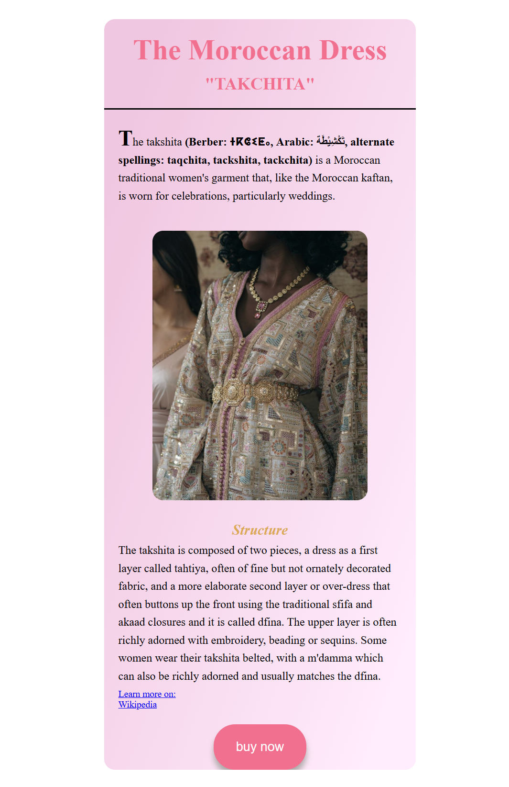

# Moroccan Dress Shop Website

## Overview

This is a Moroccan dress shop website built using HTML, CSS, and JavaScript.

The project focuses on **frontend interactivity** by collecting user input and dynamically showing messages based on their age, name, and preferences.

When users visit or reload the page, they are prompted to enter their name and age.

_Screenshot:_

- 

---

## Features

- User input for name and age
- Age validation (users under 14 cannot view dresses)
- Collects email and favorite color if age is 14 or above
- Personalized confirmation message including favorite color
- "Buy Now" button (non-functional placeholder)

---

## Tech Stack

- HTML
- CSS
- JavaScript (Vanilla JS)

---

## How It Works

- When the page loads, a prompt asks for the user's name and age.
- If no age is entered, or if the age is under 14, the website displays a message:
  - "Sorry, dresses for girls under 14 are not available."
- If age is 14 or above, the user is asked for their email and favorite color.
- A personalized message is displayed dynamically:
  - "Thank you, [name]! We'll provide you with the catalog of dresses in [favorite color]."
- The "Buy Now" button is displayed but does not perform any action.

_Note: This is a frontend-only project. The email input does not send real emails, and no backend is connected._

---

## Installation

1. Clone the repository:

   `git clone https://github.com/yourusername/moroccan-dress-shop.git`

2. Open `index.html` in your browser.

_Or just [click here to view it live on Netlify](https://takchita.netlify.app/)._

---

## What I Practiced

- DOM manipulation
- Event listeners
- Conditional logic based on user input
- Dynamically updating UI messages with JavaScript
- Simple frontend user experience design
